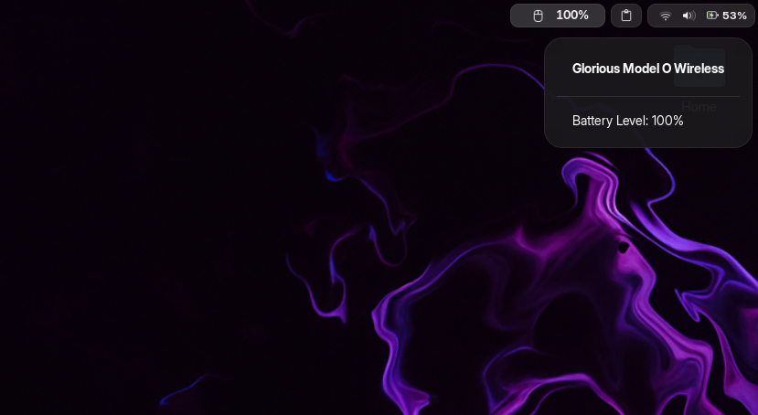

# Glorious Model O Battery for GNOME

GNOME Shell extension that displays battery level and charging status for Glorious Model O Wireless mouse in the top bar.



## Features

This extension adds a battery indicator to your GNOME Shell top panel that shows:
- Current battery percentage
- Charging status with color indicators
- Battery status in a dropdown menu

The indicator automatically hides when the mouse is disconnected or in sleep mode.

## Installation

### Prerequisites
- GNOME Shell version 45
- Glorious Model O Wireless mouse
- `mow` command line tool for reading battery status (see below for installation)

### Installing MOW dependency
The extension requires the `mow` command line tool, which can be installed from:
https://github.com/korkje/mow

To install MOW:
```bash
# Clone the repository
git clone https://github.com/korkje/mow
cd mow

# Install using cargo (requires Rust)
cargo install --path .
```

If you don't have Rust installed, first install it using:
```bash
curl --proto '=https' --tlsv1.2 -sSf https://sh.rustup.rs | sh
```

### Manual Installation
1. Download the latest release
2. Extract to `~/.local/share/gnome-shell/extensions`
3. Enable using Extensions app or Extensions Manager

### Installation from extensions.gnome.org
1. Visit [extensions.gnome.org](https://extensions.gnome.org)
2. Search for "Glorious Model O Battery Indicator"
3. Click the toggle switch to install and enable

## Features

- 🔋 Real-time battery level monitoring
- ⚡ Charging status indication with color changes
- 🎮 Specifically designed for Glorious Model O Wireless mouse
- 🎯 Clean and minimal top bar integration
- 💤 Auto-hide when mouse is disconnected or asleep
- 🎨 Intuitive color indicators:
  - Yellow: Charging
  - Green: Fully charged
  - Default: Normal operation

## Requirements

- GNOME Shell 45 or later
- Glorious Model O Wireless mouse
- `mow` command line tool (Rust-based utility for Glorious Model O Wireless mouse)

## Usage

The extension will automatically display your mouse's battery level in the top bar once enabled. Click on the indicator to see more details in a dropdown menu.

The indicator will:
- Show battery percentage
- Change color based on charging status
- Hide automatically when the mouse is disconnected or asleep
- Update every 10 seconds

## Development

The extension is built using standard GNOME Shell extension APIs and modern JavaScript practices. Contributions are welcome!

### Project Structure
```
.
├── extension.js      # Main extension code
├── metadata.json    # Extension metadata
├── stylesheet.css   # Extension styles
└── README.md       # This documentation
```

## Contributing

Contributions are welcome! Feel free to submit issues and pull requests.

## License

This project is licensed under the GPL-2.0 License - see the LICENSE file for details.

## Author

Seyhan Kokcu

## Acknowledgments

- GNOME Shell development team
- Glorious Gaming for their excellent hardware
